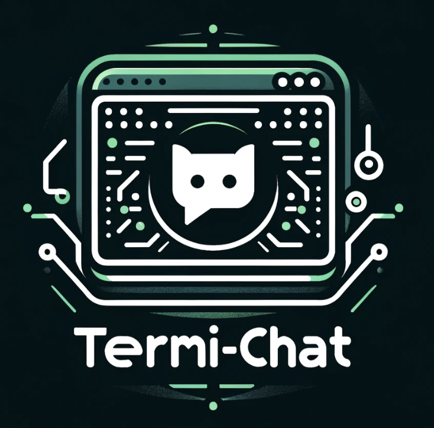

# Termi-Chat: Terminal based LLM chatbot

<div align="center">
    
</div>

Termi-Chat is a chatbot similar to the ChatGPT webUI but requires only a terminal.

Some of us like webapges but sometimes you just want a terminal, for the former,
see chat.opanai.com, for the latter, termi-chat is for you.

NOTE: there are a ton of chatbots that use the OpenAI API.  The `termi-chat`
app solves my particular style of use: speed, custom (editable) context, with
conversations that can be saved and searched, plain text that can be easily
manipulated.

## Requirements

* Openai [API Key](https://platform.openai.com/api-keys) (if you are using OpenAI models).
* Have [text-generation-webui](https://github.com/oobabooga/text-generation-webui) API up
  and running on port 5000 (if you are using local LLMs).  Characters have to be configured.
  On my local setup, I have `Cassie` and `Assistant`.
* Python and the openai package (via `pip install openai`)
* Terminal where you can run termi-chat.py
* Podman or Docker if you want to run in a container

## Features

* Lightweight: all you need is a terminal.
* Colored text for easy reading.
* No streaming -- just give me the answers!
* Switch OpenAI models on the fly.  If you want deeper answers or simpler/faster/cheaper
  answers, just restart termi-chat using a different model or use the `model` command
  to switch models *mid-conversation*.  This is useful if you're interested in how the
  "other" model would respond.
* Switch to local LLM on the fly.
* Save and load your conversation so you can have a longer term conversation
  * Conversations are simple json so you can add/remove to/from more easily
  * Conversations are plain text which means you can archive and search them
    as easily as you can with your notes.  ChatGPT conversations become a part
    of your notes vs. asking over and over for the same thing.
  * Gives a good way to organize and manage your conversations.
* Press `<ENTER>` to submit the text after seeing how many tokens (in case you are cost conscious).
  * use the `max` command to use only the last `n` messages for the context (reduces token count).
* Tracks response times in case you like to know how long it takes to respond.


## Limitations

* No image (dalle) support


## Environment setup

### Conda for python environemnt

I use `conda` but you can use any python environment tool.

```bash
conda create -n termi-chat python=3.11
conda activate termi-chat
pip install openai
conda env list
```

### Running in a container

If you want to run termi-chat in container, you'll need one of [podman](podman.io) or [docker](docker.com).

## User Interface

* The input method allows you to copy/paste and/or type input including new lines.
  This allows you to format your input for readability.  Use control-d on a line by itself
  to submit the input.
* Time and conversation changes are noted so that you are reminded to save your work
  (though saving is optional).
* I purposely ask you to press `<ENTER>` to send the message.  This gives a final chance
  to see what you typed and how many tokens it will consume *before* sending it to the
  model.  Remember OpenAI charges by the token and if your context is too big, some of
  it will be lost.  You can type `cancel` if you don't want to send the text and that
  text will be removed from the context.

### Suggested Workflow

 * Make a directory somewhere and create a git repo in it; this will allow you to track changes
   to your conversations and/or modify them to prune out content you don't want to retain or
   use for future conversations (e.g., smalltalk, bad answers, long answers, unnecessary code
   snippets, etc.).
 * Start with a basic converation that has only a system prompt with enough information
   to prime the model for answering questions in a productive way like this below:

   ```json
   [
     {
      "role": "system",
      "content": "You are a helpful assistant who is versed in software engineering, AI, and LLMs.  Your way of communicating is casual but you can get into the very technical details upon request.  You use emoji in your communication once in a while and are encouraging as a mentor would be.  You are talking to Dennis who is a software engineer who knows Linux, and has written programs in go, python, javascript, and running on Kubernetes"
     }
   ]
   ```

   The above sets the model up so you can ask it programming questions and it won't be inclined to take
   up space/tokens to explain basic programming concepts.

  * As you build enough conversation content, save often to and do `git diff` to see what change; commit
    the changes or discard them as you go (similar to how you would for code changes).
  * Store the git repo of conversations somewhere safe (backed up and secure) as these are now part of your
    permanent notes.
  * Monitor your [API usage](https://platform.openai.com/usage) to ensure you're not using too much of your
    credits.  Note the [openapi costs](https://openai.com/pricing#language-models) listed here and copied
    from that page for convenience (thoug they may change):

    * for gpt3.5: $0.0005/1K tokens, $0.0015/1K tokens
    * for gpt4: $0.03/1K tokens, $0.06/1K tokens
  * A good time to switch to `termi-chat`` is when you've reached the OpenAI chatgpt4 usage cap of
    40 messages/per hour.  API usage and chatgpt webUI (plus accounts) are billed separately so API
    usage is not subject to usage caps.

### Changing the model

Sometimes you're in a conversation with the more expensive gpt4 model and want to start asking
questions about coding.  A lot of times, you don't need gpt4 for this.  So, save your work, quit
and restart termi-chat with the gpt3.5 model using the `--load <conversation.json>` option to
load your existing conversation in.  Now you can continue the conversation on the less expensive
model.  Compare this with the ChatGPT webUI where you'd have to repeat your conversation when you
switch models.


### Example script to allow you to select conversations

Since there's no webUI, you'll have to make up your own script to select conversations if you
need this convenience.  The [select.sh](./utilities/select.sh) is an example.

## Convert ChatGPT UI conversations to saved context

Use [chatgpt-exporter](https://github.com/pionxzh/chatgpt-exporter/tree/master) to export
your conversations from the ChatGPT webui.  `chatgpt-exporter` does a good job
of exporting conversations but the json has a lot of information I don't care to save.
These utilitiy scripts will extract the parts I do care about; one is in bash and another in python:

* [chatgptui_to_simply.py](./utilities/chatgptui_to_simple.py)
* [chatgptui_to_simply.sh](./utilities/chatgptui_to_simple.sh)

NOTE: if you need to debug, the python script will be preferred.

The `chatgpt-exporter` will put a ChatGPT saved conversation (on the left side of the ChatGPT UI)
in a json file named after the ChatGPT conversation title.  The converted file can be loaded
into the [termi-chat](./python/termi-chat.py) using the `load` command.

To use `chatgpt-exporter`, browse to ChatGPT UI, select your conversation, click Export/Json,
then run the utility script above on that file.  The resulting file will be generated based on
the `.title` in the exported json file.

You can do this for any conversation and repeatedly for the same conversation as that conversation
is updated.  This way, you don't have to worry about capturing only the new parts of the
conversation.

NOTE: keep these under source control so you can see that your changes are adding and not
replacing text (if you care about that).  For example, you can do this:

```bash
git init .
git add .
git commit -m 'initial'
```

Then you can keep adding more files.  This is a private git repo you can store somewhere locally
especially if you don't want to share the conversations or don't want them on github.com.  You
will still get history and all github has to offer -- just locally.

## Usage examples

* [Basic usage with just a custom system prompt](./doc/basic_usage.md).

## Development: Build, push, run as container

### Building and pushing the container

Bump the version number in `VERSION`.

```bash
make use-podman ;# or make use-docker
make build
podman login -u <YourUserId>
make push
```

### Running the container

For running from a container, you only need `docker` or `podman`.  I create a directory
where my conversations will be saved at `/home/dperique/termi-chats`, set my
[API key](https://platform.openai.com/api-keys), and then run:

```bash
mkdir /home/dperique/termi-chats
export OPENAI_API_KEY=sk...
podman run -it --rm \
    -v /home/dperique/termi-chats:/termi-chats \
    -e OPENAI_API_KEY=${OPENAI_API_KEY} \
    dperique/termi-chat:${VERSION} --load /termi-chats/dennis_golang.json --model gpt3.5 --names Cassy,Dennis
```

## Todo

* the context that keeps building will make our usage cost keep getting bigger
  * make some kind of pipeline that can prune out certain context we don't care to remember
    * like code -- no one needs to remember multiple versions of programs so prune these out.
    * any ai generated text -- or just save some bullet points so it remembers roughly what it told me
    * any extra stuff that doesn't matter like small talk
    * think of things you would remember in human conversations and what most people tend to forget
  * add a mechanism so that if the user asks about something, maybe looking for "remember when...",
    we can search for context and swap that in so that the context is smaller everytime we call the api -- maybe memgpt.
* Add support for local LLM such that you can select the model by name instead of just whatever
  is currently running.
* Ensure the system prompt stays in the message even if you set max_content to a small number.  We need the
  system prompt to ensure the conversation stays on topic and character.
* When running with local LLM within the container, we cannot see the correct url from within the container
  (because containers have their own localhost).
* Make a way to access http://localhost:5000 from within the container
  * We can use an outside address but add a `--host` option with 127.0.0.1 as default.
* Make this a class, then you can instantiate multiple and in the text, you can use @conversation to send
  text to a specific instance.  Then you can have two conversations.  You can then use two different models
  at the same time so that you can get code snippet with gpt3.5 and more deep stuff with gpt4

