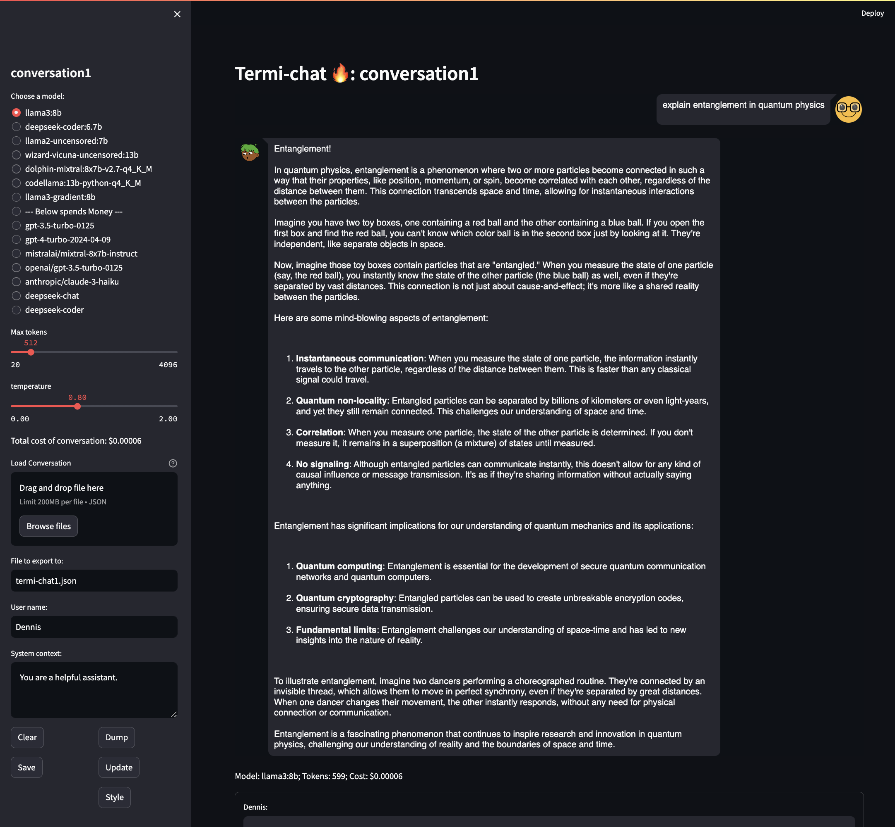

<div align="center">

# Termi-Chat: Terminal based LLM chatbot
</div>

<div align="center">
    
</div>

Termi-Chat is a chatbot similar to the ChatGPT webUI but requires only a terminal.

Some of us like webapges but sometimes you just want a terminal, for the former,
see chat.opanai.com (or termi-chat's improvised [streamlit version](#the-streamlit-version)), for
the latter, termi-chat is for you.

NOTE: there are a ton of chatbots that use the OpenAI API.  The `termi-chat`
app solves my particular style of use: speed, custom (editable) context, with
conversations that can be saved and searched, plain text that can be easily
manipulated.

In this short demo below, keep in mind:

* There is a python env (using conda, and called `termi-chat`) where `pip install -r requirements.txt` is already applied
* Control-d is used so that you can have multi-line input; end your input by pressing Control-d on a blank line (edit your
  line with the left/right arrow keys as you would in a bash prompt)
* Control-d on a blank line, with no input, brings up the menu palette (that's where you can chose an LLM or get info on
  the currently selected LLM (including description, context size, and cost))
  * When on a menu chooser, search by typing `/` and then substring characters (similar to searching in vim)
* My `OPENROUTER_API_KEY` is already defined
* The conversation is viewed and saved at the end
* The captured conversation is shown in the json file

<div align="center">
    
</div>

## Requirements

* `OPENAI_API_KEY` set to your Openai [API Key](https://platform.openai.com/api-keys) (if you are using OpenAI models).
* `OPENROUTER_API_KEY` set to your Openrouter.ai [API Key](https://openrouter.ai/keys) (if you are using Openrouter.ai models).
* Have [text-generation-webui](https://github.com/oobabooga/text-generation-webui) API up
  and running on port 5000 (if you are using local LLMs).  Characters have to be configured.
  On my local setup, I have `Cassie` and `Assistant`.
* See the [python requirements.txt](./requirements.txt)
* Terminal where you can run termi-chat.py
* Podman or Docker if you want to run in a container

## Features

* Lightweight: all you need is a terminal.
* Colored text for easy reading.
* No streaming -- just give me the answers!
* Switch models on the fly.  If you want deeper answers or simpler/faster/cheaper/free
  answers, just restart termi-chat using a different model or use the `model` command
  to switch models *mid-conversation*.  This is useful if you're interested in how the
  "other" model would respond.
  * Use the "resend" command to just resend your current conversation (this allows you
    to try what you just asked to a different model).
* Costs are tracked and shown in real-time so you know much you've spent.
* Now supports models hosted on [openrouter.ai](openrouter.ai).  That's a lot of models!
* Save and load your conversation so you can have a longer term conversation
  * Conversations are simple json so you can archive, modify, or search them with
    any tet editor.
  * Your LLM conversations become a part of your notes so you don't have to keep
    asking the same questions over and over.
  * Gives a good way to organize and re-use your conversations.
* use the `max` command to use only the last `n` messages for the context (reduces token count).
* Tracks model used, response times, and cost of api calls in the saved json.
* A [Streamlit-based version (work in progress)](./python/sl_TermChat.py)
  * If you really want a UI, use an instance this per conversation


## Limitations

* No image (dalle) support


## Environment setup

### Run using Conda or venv python environment

I use `conda` but you can use any python environment tool.

```bash
conda create -n termi-chat python=3.11
conda activate termi-chat
pip install -r requirements.txt

./python/termi-chat.py --load basic.json
```

If you want to just use venv, do this:

```bash
python -m venv venv
source venv/bin/activate
pip install -r requirements.txt

./python/termi-chat.py --load basic.json
```


### Setup local LLM server

By default, the code looks for `http://localhost:5005` (or something similar).  You need something there to
respond that can respond (e.g., via `curl`) to api requests where we pass the user's conversation/context.

I use [text-generation-webui](https://github.com/oobabooga/text-generation-webui/tree/main).

You can set this up manually or you can use [runpod.io](runpod.io) or any other service.  In runpod.io,
use the `TheBloke Local LLMs One-Click UI and API` template and a GPU container that can run the model you
want to load.  Set the `MODEL` environment variable to a huggingface model like `TheBloke/Wizard-Vicuna-7B-Uncensored-GPTQ`
which will run comfortably on an RTX 3090 GPU (actually, it runs fine on my RTX 3060 but runpod.io no longer
has these available).

After the your runpod.io pod finishes coming up, make an ssh tunnel using a command like this:

```
ssh -L 5005:127.0.0.1:5000 root@x.x.x.x -p 14334 -i ~/.ssh/id_ed25519
```

The part that makes the tunnel is `-L 5005:127.0.0.1:5000`.  The rest is from the runpod.io UI.

Test the tunnel to ensure it responds successfully like this:

```
$ nc -vz 127.0.0.1 5005
Connection to 127.0.0.1 port 5005 [tcp/avt-profile-2] succeeded!
```

If you don't have `nc`, don't worry about it. You can test connectivity "in action" when you run termi-chat
with your local model.

NOTE: port 5005 is chosen arbitrarily.  You can pick any free port but you'll have to
modify the line that says something like `url = "http://127.0.0.1:5005/v1/chat/completions"`.

### Running in a container

If you want to run termi-chat in container, you'll need one of [podman](podman.io) or [docker](docker.com).

## User Interface

* The input method allows you to copy/paste and/or type input including new lines.
  This allows you to format your input for readability.  Use control-d on a line by itself
  to submit the input.
* Time and conversation changes are noted so that you are reminded to save your work
  (though saving is optional).
* I purposely ask you to press `<ENTER>` to send the message.  This gives a final chance
  to see what you typed and how many tokens it will consume *before* sending it to the
  model.  Remember OpenAI charges by the token and if your context is too big, some of
  it will be lost.  You can type `cancel` if you don't want to send, and that
  text will be removed from the context.

### Suggested Workflow

 * Make a directory somewhere and create a git repo in it; this will allow you to track changes
   to your conversations and/or modify them to prune out content you don't want to retain or
   use for future conversations (e.g., smalltalk, bad answers, long answers, unnecessary code
   snippets, etc.).
 * Start with a basic converation that has only a system prompt with enough information
   to prime the model for answering questions in a productive way like this below:

   ```json
   [
     {
      "role": "system",
      "content": "You are a helpful assistant who is versed in software engineering, AI, and LLMs.  Your way of communicating is casual but you can get into the very technical details upon request.  You use emoji in your communication once in a while and are encouraging as a mentor would be.  You are talking to Dennis who is a software engineer who knows Linux, and has written programs in go, python, javascript, and running on Kubernetes"
     }
   ]
   ```

   The above sets the model up so you can ask it programming questions and it won't be inclined to take
   up space/tokens to explain basic programming concepts.

  * As you build enough conversation content, save often to and do `git diff` to see what change; commit
    the changes or discard them as you go (similar to how you would for code changes).
  * Store the git repo of conversations somewhere safe (backed up and secure) as these are now part of your
    permanent notes.
  * Monitor your [API usage](https://platform.openai.com/usage) to ensure you're not using too much of your
    credits.  Note the [openapi costs](https://openai.com/pricing#language-models) listed here and copied
    from that page for convenience (thoug they may change):

    * for gpt3.5: $0.0005/1K tokens, $0.0015/1K tokens
    * for gpt4: $0.03/1K tokens, $0.06/1K tokens
  * A good time to switch to `termi-chat`` is when you've reached the OpenAI chatgpt4 usage cap of
    40 messages/per hour.  API usage and chatgpt webUI (plus accounts) are billed separately so API
    usage is not subject to usage caps.

### Selecting a conversation

Startup termi-chat.py without with --load option with a directory and you'll see a menu to
select the conversation. Type `/` to start searching or up/down arrows to navigate.

### Changing the model

Sometimes you're in a conversation with the more expensive gpt4 model and want to start asking
questions about coding.  A lot of times, you don't need gpt4 for this.  You can change the model
mid-conversation in one of two ways:

* save your work, quit, and restart termi-chat with the gpt3.5 model using the
  `--load <conversation.json>` option to load your existing conversation in.
* use control-D to get to the command palette and change the model to a less expensive model.

## Convert ChatGPT UI conversations to saved context

Use [chatgpt-exporter](https://github.com/pionxzh/chatgpt-exporter/tree/master) to export
your conversations from the ChatGPT webui.  `chatgpt-exporter` does a good job
of exporting conversations but the json has a lot of information I don't care to save.
These utilitiy scripts will extract the parts I do care about; one is in bash and another in python:

* [chatgptui_to_simply.py](./utilities/chatgptui_to_simple.py)
* [chatgptui_to_simply.sh](./utilities/chatgptui_to_simple.sh)

NOTE: The python version is preferred; if you need to debug, the python script will be preferred.

The `chatgpt-exporter` will put a ChatGPT saved conversation (on the left side of the ChatGPT UI)
in a json file named after the ChatGPT conversation title.  The converted file can be loaded
into the [termi-chat](./python/termi-chat.py) using the `load` command.

To use `chatgpt-exporter`, browse to ChatGPT UI, select your conversation, click Export/Json,
then run the utility script above on that file.  The resulting file will be generated based on
the `.title` in the exported json file.

You can do this for any conversation and repeatedly for the same conversation as that conversation
is updated.  This way, you don't have to worry about capturing only the new parts of the
conversation.

NOTE: keep these under source control so you can see that your changes are adding, and not
replacing, text (if you care about that).  For example, you can do this:

```bash
git init .
git add .
git commit -m 'initial'
```

Then you can keep adding more files.  This is a private git repo you can store somewhere locally
especially if you don't want to share the conversations or don't want them on github.com.  You
will still get history and all git has to offer -- just locally.

## Usage examples

* [Basic usage with just a custom system prompt](./doc/basic_usage.md).

## Development: Build, push, run as container

### Building and pushing the container

Bump the version number in `VERSION`.

```bash
make use-podman ;# or make use-docker
make build
podman login -u <YourUserId>
make push
```

### Running the container

For running from a container, you only need `docker` or `podman`.  I create a directory
where my conversations will be saved at `/home/dperique/termi-chats`, set my
[API key](https://platform.openai.com/api-keys), and then run:

```bash
mkdir /home/dperique/termi-chats
export OPENAI_API_KEY=sk...
podman run -it --rm \
    -v /home/dperique/termi-chats:/termi-chats \
    -e OPENAI_API_KEY=${OPENAI_API_KEY} \
    dperique/termi-chat:${VERSION} --load /termi-chats/dennis_golang.json --model gpt3.5 --names Cassy,Dennis
```

## Todo

* the context that keeps building will make our usage cost keep getting bigger
  * make some kind of pipeline that can prune out certain context we don't care to remember
    * like code -- no one needs to remember multiple versions of programs so prune these out.
    * any ai generated text -- or just save some bullet points so it remembers roughly what it told me
    * any extra stuff that doesn't matter like small talk
    * think of things you would remember in human conversations and what most people tend to forget
  * add a mechanism so that if the user asks about something, maybe looking for "remember when...",
    we can search for context and swap that in so that the context is smaller everytime we call the api -- maybe memgpt.
* Add support for local LLM such that you can select the model by name instead of just whatever
  is currently running.
  * [ollama](https://github.com/ollama/ollama/tree/main) might be the way to go here
    * You can list (generate a menu for selection), select local models from a menu, etc.

### bugs

* Software is still under test ...
* I want to do this (test.json doesn't exist):

```
./python/termi-chat.py --model Cassie --load ~/Desktop/Dropbox/ShareOut/Redhat/termi-chats/test.json --names Cassie,Dennis
```

and then save to test.json ; this way, I can create new chats at will without creating files manually.

Workaround: use [run_container.sh](./utilities/run_container.sh) which creates a file for you.

### Coding, Enhancements, etc.

* add anthropic api support (Anthropic (claude) LLMs are already in openrouter.ai)
* allow a second LLM source so I can have two LLMs up and not have to wait for LLMs to load.
* allow me to set the temperature and maybe max tokens on the replies
* add error checking on reponses from openrouter.ai (e.g., for checking rate limits, etc.)
* add way to query openrouter.ai for credits and usage limits, etc.
* use https://click.palletsprojects.com/en/8.1.x/ for command line options

### Tips

* You can use `jq` to extract content from the conversation json files like this:

```bash
$ cat conversation.json |jq -r '.[3].content'`
```

## The streamlit version

Well sometimes it's nice to have a webui. So I improvised a streamlit version.

This version is run via a webpage and streamlit like this:

```bash
streamlit run --browser.gatherUsageStats false --server.port 8501 --theme.base dark python/sl_TermChat.py conversation1
```

In the streamlit app, we use a limited set of model choices and still allow you to
save and load previous chats.

<div align="center">
    
</div>